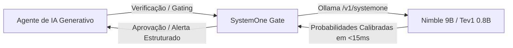

# 📘 Manual de Integração do SystemOne Gate para Agentes de IA

Este guia orienta como conectar o **SystemOne Gate** a **qualquer agente de Inteligência Artificial** (Claude Code, Antigravity, Cursor, Windsurf, Cline, Roo Code, Aider, LangChain, CrewAI, AutoGen).

---

## 🧠 Por que usar o SystemOne Gate com Agentes de IA?

Agentes de IA generativos (modelos de nuvem como GPT, Claude e Gemini) são excepcionais para raciocínio profundo e geração de código, mas são **lentos e caros** para verificações repetitivas em segundo plano.

O **SystemOne Gate** atua como o sistema reflexo / córtex motor de baixa latência dos agentes:



* **Zero custo de tokens na nuvem:** 100% executado na GPU/CPU local.
* **Privacidade total:** Nenhum código ou diff sai da sua máquina.
* **Saída determinística:** Sem alucinação de texto prolixo; apenas probabilidades numéricas e rótulos tipados (`choice` e `score`).

---

## ⚙️ Pré-requisitos e Setup do Ambiente

Antes de configurar qualquer agente, certifique-se de que o backend local do Ollama está instalado e com os modelos prontos:

1. **Instale ou atualize o Ollama para v0.35+**:
   ```bash
   # Linux
   curl -fsSL https://ollama.com/install.sh | sh

   # macOS / Windows
   # Baixe em https://ollama.com/download
   ```
2. **Verifique a versão**:
   ```bash
   ollama -v  # Deve ser >= 0.35.0
   ```
3. **Baixe os modelos necessários**:
   ```bash
   ollama pull tev1:0.8b  # Modelo de reflexo rápido (<15ms, 811MB)
   ollama pull nimble     # Modelo de precisão para código (9B, 9.5GB)
   ```
4. **Instale o pacote localmente**:
   ```bash
   git clone https://github.com/beliciobcardoso/systemone_gate.git
   cd systemone_gate
   pip install -e .
   ```

---

## 1. Antigravity (Google DeepMind)

O Antigravity suporta nativamente servidores MCP e Skills modulares.

Docs oficiais: https://antigravity.google/docs/mcp e https://antigravity.google/docs/skills

### Passo 1: Registrar o Servidor MCP
Edite o arquivo global `~/.gemini/config/mcp_config.json` (ou `.agents/mcp_config.json` no workspace):

```json
{
  "mcpServers": {
    "systemone": {
      "command": "/usr/bin/python3",
      "args": ["-m", "systemone_gate.mcp_server"],
      "env": {
        "PYTHONPATH": "/caminho/para/systemone_gate"
      }
    }
  }
}
```

### Passo 2: Registrar a Skill
Crie `~/.gemini/config/skills/systemone-gate/SKILL.md`:
```markdown
---
name: systemone-gate
description: Ultra-fast local decision gate using Ollama System One (Nimble & Tev1). Use for real-time error triage, pre-commit diff risk review, and command safety.
---

Quando houver falha de compilação, erro de testes ou necessidade de avaliar o risco de um patch antes do commit, acione a ferramenta `systemone_triage_error` ou `systemone_review_diff`.
```

---

## 2. Claude Desktop & Claude Code

O Claude Code e o Claude Desktop utilizam a especificação padrão do **Model Context Protocol (MCP)**.

Docs oficiais: https://code.claude.com/docs/en/mcp (Claude Code) e https://modelcontextprotocol.io/quickstart/user (Claude Desktop).

### No Claude Desktop (`claude_desktop_config.json`):
A doc oficial lista apenas macOS e Windows (Configurações > Developer > Edit Config).
* **Linux:** `~/.config/Claude/claude_desktop_config.json` (⚠️ não verificado em fonte oficial; a doc oficial não lista Linux)
* **macOS:** `~/Library/Application Support/Claude/claude_desktop_config.json`
* **Windows:** `%APPDATA%\Claude\claude_desktop_config.json`

```json
{
  "mcpServers": {
    "systemone-gate": {
      "command": "python3",
      "args": ["-m", "systemone_gate.mcp_server"],
      "env": {
        "PYTHONPATH": "/caminho/para/systemone_gate"
      }
    }
  }
}
```

### No Claude Code (CLI):
Registre via CLI. O `--` é obrigatório para separar as opções do `claude mcp add` das flags do comando do servidor (como o `-m`):
```bash
claude mcp add systemone-gate -e PYTHONPATH=/caminho/para/systemone_gate -- python3 -m systemone_gate.mcp_server
```
O escopo padrão é `local` (privado, salvo em `~/.claude.json`). Use `--scope project` para gravar em `.mcp.json` na raiz do projeto (versionável) ou `--scope user` para todos os projetos (`~/.claude.json`). O `.mcp.json` tem o mesmo formato `mcpServers` (`command`/`args`/`env`) do Claude Desktop acima. O arquivo `.claude/config.json` não é usado para isso.

---

## 3. Cursor IDE

No Cursor, você pode expor o SystemOne Gate tanto como ferramenta MCP de background quanto através de regras de contexto (`.cursorrules`).

### Adicionando como MCP no Cursor:
Docs oficiais: https://cursor.com/docs/context/mcp

Edite `~/.cursor/mcp.json` (global) ou `.cursor/mcp.json` (projeto). A navegação por menus muda entre versões do Cursor; a doc atual aponta o painel **Customize** na barra lateral.

```json
{
  "mcpServers": {
    "systemone": {
      "command": "python3",
      "args": ["-m", "systemone_gate.mcp_server"],
      "env": {
        "PYTHONPATH": "/caminho/para/systemone_gate"
      }
    }
  }
}
```

### Configurando no `.cursorrules` da raiz do projeto:
```markdown
# Diretrizes de Gating e Validação Automática
Antes de propor comandos destrutivos no terminal ou finalizar alterações grandes de arquitetura:
1. A ferramenta MCP `systemone_command_guard` é apenas um AVISO heurístico (modelo de 0.8B erra comandos destrutivos óbvios); o veredito "safe" não autoriza nada. Para comandos como `rm -rf`, `docker prune` ou resets no banco, peça confirmação explícita ao usuário.
2. Em caso de erros de compilação no terminal, consulte `systemone_triage_error` para identificar a causa raiz antes de tentar aplicar correções cegas.
```

---

### Enforcement real no Claude Code

O `systemone_command_guard` depende do agente decidir chamá-lo e do modelo acertar: é um aviso, não uma barreira de segurança. Enforcement real precisa viver FORA do agente. No Claude Code, registre o hook `PreToolUse` em `~/.claude/settings.json`:

```json
{
  "hooks": {
    "PreToolUse": [
      { "matcher": "Bash", "hooks": [{ "type": "command", "command": "systemone-gate hook-guard" }] }
    ]
  }
}
```

O `hook-guard` é determinístico, offline e não chama o modelo: comandos que casam com uma regra são bloqueados (exit 2) e o motivo é devolvido ao agente. Payload inválido não bloqueia, mas emite um aviso no stderr.

As regras cobrem apenas padrões catastróficos e inequívocos (texto entre aspas passado como argumento não bloqueia):
* `rm` recursivo em `/`, `~`, `$HOME` ou diretório de sistema (`/etc`, `/usr`, `/var`...), ou com `--no-preserve-root`;
* `dd of=/dev/sdX`, `mkfs`/`mkswap` em `/dev/*` e redirecionamento `> /dev/sdX`;
* fork bomb;
* `chmod`/`chown -R` em `/` ou diretório de sistema;
* `git push --force`/`-f` (ou `+main`) em `main`/`master` (`--force-with-lease` não bloqueia);
* `DROP TABLE|DATABASE|SCHEMA`, `TRUNCATE` e `DELETE FROM` sem `WHERE`;
* `curl`/`wget` com pipe para `sh`/`bash`.

Fora disso, a decisão continua sendo humana. Não é um sandbox: variáveis expandidas em runtime, scripts e Makefiles não são analisados.

---

## 4. Windsurf (Codeium Cascade)

> ⚠️ Não verificado em fonte oficial nesta versão do manual; confirme na documentação do Windsurf (a doc oficial foi migrada para docs.devin.ai e a página consultada não cita este caminho).

O Windsurf suporta servidores MCP através do painel de extensões e do arquivo de configuração `~/.codeium/windsurf/mcp_config.json`:

```json
{
  "mcpServers": {
    "systemone-gate": {
      "command": "python3",
      "args": ["-m", "systemone_gate.mcp_server"],
      "env": {
        "PYTHONPATH": "/caminho/para/systemone_gate"
      }
    }
  }
}
```

---

## 5. Cline / Roo Code (VS Code Extension)

> ⚠️ Não verificado em fonte oficial nesta versão do manual; confirme na documentação do Cline e do Roo Code (o nome `cline_mcp_settings.json` não foi confirmado; no Roo o arquivo é `mcp_settings.json` ou `.roo/mcp.json`, e a chave de aprovação automática documentada é `alwaysAllow`, não `autoApprove`).

Docs: https://docs.cline.bot/mcp/configuring-mcp-servers e https://roocodeinc.github.io/Roo-Code/features/mcp/using-mcp-in-roo

No VS Code com a extensão **Cline** ou **Roo Code**:
1. Clique no ícone de MCP na barra lateral do Cline.
2. Clique em **Configure MCP Servers** (abre `cline_mcp_settings.json`).
3. Adicione a configuração:

```json
{
  "mcpServers": {
    "systemone": {
      "command": "python3",
      "args": ["-m", "systemone_gate.mcp_server"],
      "env": {
        "PYTHONPATH": "/caminho/para/systemone_gate"
      },
      "disabled": false,
      "autoApprove": [
        "systemone_triage_error",
        "systemone_review_diff"
      ]
    }
  }
}
```

---

## 6. Aider (AI Pair Programming CLI)

O Aider roda comandos de terminal nativamente. Você pode configurar o Aider para executar o `systemone-gate diff` automaticamente antes de cada commit.

No arquivo `.aider.conf.yml` na raiz do seu projeto:

```yaml
# Executa a verificação local do SystemOne Gate antes de commitar
lint-cmd: "python3 -m systemone_gate.cli diff"
auto-commits: true
```

---

## 7. Agentes em Python (LangChain, CrewAI, AutoGen, LlamaIndex)

Você pode importar a biblioteca diretamente dentro do código dos seus agentes para criar nós de roteamento e guardrails:

```python
from systemone_gate import PolicyConfig, SystemOneClient, evaluate_command

client = SystemOneClient()
policy = PolicyConfig.from_env()

# 1. Roteamento de agente (qual especialista deve resolver o prompt?)
routing = client.route_task("Precisamos otimizar os locks na fila de mensagens do broker MQTT")
specialist = routing["answers"]["assigned_specialist"]["choice"]
complexity = routing["answers"]["task_complexity"]["score"]

print(f"Especialista: {specialist} | Complexidade: {complexity:.2f}")

# 2. Guardrail antes de rodar tool de bash
cmd_check = client.guard_command("rm -rf /tmp/mosquitto.db && make clean")
decision = evaluate_command(cmd_check, policy)  # trata erro do Ollama e resposta inválida
if decision.warning:
    print(f"Aviso do SystemOne Gate: {decision.warning}")
if decision.action == "block":
    raise PermissionError(f"Comando bloqueado pelo SystemOne Gate: {'; '.join(decision.reasons)}")

# 3. Triagem de erro
triage = client.triage_error("undefined reference to mqtt3_db_open")
root_cause = triage["answers"]["root_cause"]["choice"]
print(f"Causa-raiz identificada: {root_cause}")
```

> **Política de decisão única:** CLI, hook e este snippet usam `systemone_gate.policy`. Ajuste via variáveis de ambiente:
> `SYSTEMONE_GUARD_DANGER_THRESHOLD` (padrão 1.5), `SYSTEMONE_DIFF_RISK_THRESHOLD` (1.85), `SYSTEMONE_DIFF_BREAKING_THRESHOLD` (0.65),
> `SYSTEMONE_GUARD_ON_ERROR` e `SYSTEMONE_DIFF_ON_ERROR` (`allow` = libera com aviso, padrão; `block` = bloqueia se o Ollama falhar ou responder fora do formato).
> `SYSTEMONE_MIN_CONFIDENCE` (0 a 1, padrão `0` = desligado): com valor > 0, um veredito cuja `confiança` informada pelo modelo seja menor que o mínimo é tratado como indeterminado e segue a política `*_ON_ERROR` da superfície (`allow` = libera com aviso; `block` = bloqueia). Vereditos de regras determinísticas nunca são afetados; confiança ausente não penaliza.
> Esses limiares **não são calibrados** com dados reais; trate-os como pontos de partida.

---

## 8. Git Pre-Commit Hook (Universal para Qualquer Desenvolvedor/Agente)

Se você trabalha em equipe ou tem múltiplos agentes alterando o mesmo repositório, garanta que nenhum agente commite código arriscado instalando o hook diretamente no repositório:

```bash
# Na raiz do seu repositório Git:
systemone-gate install-hook
```

A partir desse momento, qualquer `git commit` executado por você, pelo Cursor, pelo Claude Code ou pelo Aider passará automaticamente pelo crivo do modelo local.
