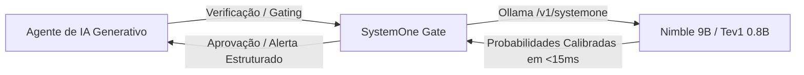

# 📘 Manual de Integração do SystemOne Gate para Agentes de IA

Este guia orienta como conectar o **SystemOne Gate** a **qualquer agente de Inteligência Artificial** (Claude Code, Antigravity, Cursor, Windsurf, Cline, Roo Code, Aider, LangChain, CrewAI, AutoGen).

---

## 🧠 Por que usar o SystemOne Gate com Agentes de IA?

Agentes de IA generativos (GPT-4o, Claude 3.7 Sonnet, Gemini 2.5/3.8) são excepcionais para raciocínio profundo e geração de código, mas são **lentos e caros** para verificações repetitivas em segundo plano.

O **SystemOne Gate** atua como o sistema reflexo / córtex motor de baixa latência dos agentes:



* **Zero custo de tokens na nuvem:** 100% executado na GPU/CPU local.
* **Privacidade total:** Nenhum código ou diff sai da sua máquina.
* **Saída determinística:** Sem alucinação de texto prolixo; apenas probabilidades numéricas e rótulos tipados (`choice` e `score`).

---

## 1. Antigravity (Google DeepMind)

O Antigravity suporta nativamente servidores MCP e Skills modulares.

### Passo 1: Registrar o Servidor MCP
Edite o arquivo global `~/.gemini/config/mcp_config.json`:

```json
{
  "mcpServers": {
    "systemone": {
      "command": "/usr/bin/python3",
      "args": ["-m", "systemone_gate.mcp_server"],
      "env": {
        "PYTHONPATH": "/caminho/para/systemone_gate"
      }
    }
  }
}
```

### Passo 2: Registrar a Skill
Crie `~/.gemini/config/skills/systemone-gate/SKILL.md`:
```markdown
---
name: systemone-gate
description: Ultra-fast local decision gate using Ollama System One (Nimble & Tev1). Use for real-time error triage, pre-commit diff risk review, and command safety.
---

Quando houver falha de compilação, erro de testes ou necessidade de avaliar o risco de um patch antes do commit, acione a ferramenta `systemone_triage_error` ou `systemone_review_diff`.
```

---

## 2. Claude Desktop & Claude Code

O Claude Code e o Claude Desktop utilizam a especificação padrão do **Model Context Protocol (MCP)**.

### No Claude Desktop (`claude_desktop_config.json`):
* **Linux:** `~/.config/Claude/claude_desktop_config.json`
* **macOS:** `~/Library/Application Support/Claude/claude_desktop_config.json`
* **Windows:** `%APPDATA%\Claude\claude_desktop_config.json`

```json
{
  "mcpServers": {
    "systemone-gate": {
      "command": "python3",
      "args": ["-m", "systemone_gate.mcp_server"],
      "env": {
        "PYTHONPATH": "/caminho/para/systemone_gate"
      }
    }
  }
}
```

### No Claude Code (CLI):
Adicione ao seu arquivo `.claude/config.json` do projeto ou execute:
```bash
claude mcp add systemone-gate python3 -m systemone_gate.mcp_server
```

---

## 3. Cursor IDE

No Cursor, você pode expor o SystemOne Gate tanto como ferramenta MCP de background quanto através de regras de contexto (`.cursorrules`).

### Adicionando como MCP no Cursor:
1. Abra as **Settings** do Cursor (`Ctrl+,` ou `Cmd+,`).
2. Vá em **Features > MCP Servers > Add New MCP Server**.
3. Preencha:
   * **Name:** `systemone`
   * **Type:** `command`
   * **Command:** `python3 -m systemone_gate.mcp_server`

### Configurando no `.cursorrules` da raiz do projeto:
```markdown
# Diretrizes de Gating e Validação Automática
Antes de propor comandos destrutivos no terminal ou finalizar alterações grandes de arquitetura:
1. Use a ferramenta MCP `systemone_command_guard` antes de sugerir comandos como `rm -rf`, `docker prune` ou resets no banco.
2. Em caso de erros de compilação no terminal, consulte `systemone_triage_error` para identificar a causa raiz antes de tentar aplicar correções cegas.
```

---

## 4. Windsurf (Codeium Cascade)

O Windsurf suporta servidores MCP através do painel de extensões e do arquivo de configuração `~/.codeium/windsurf/mcp_config.json`:

```json
{
  "mcpServers": {
    "systemone-gate": {
      "command": "python3",
      "args": ["-m", "systemone_gate.mcp_server"],
      "env": {
        "PYTHONPATH": "/caminho/para/systemone_gate"
      }
    }
  }
}
```

---

## 5. Cline / Roo Code (VS Code Extension)

No VS Code com a extensão **Cline** ou **Roo Code**:
1. Clique no ícone de MCP na barra lateral do Cline.
2. Clique em **Configure MCP Servers** (abre `cline_mcp_settings.json`).
3. Adicione a configuração:

```json
{
  "mcpServers": {
    "systemone": {
      "command": "python3",
      "args": ["-m", "systemone_gate.mcp_server"],
      "env": {
        "PYTHONPATH": "/caminho/para/systemone_gate"
      },
      "disabled": false,
      "autoApprove": [
        "systemone_command_guard",
        "systemone_triage_error",
        "systemone_review_diff"
      ]
    }
  }
}
```

---

## 6. Aider (AI Pair Programming CLI)

O Aider roda comandos de terminal nativamente. Você pode configurar o Aider para executar o `systemone-gate diff` automaticamente antes de cada commit.

No arquivo `.aider.conf.yml` na raiz do seu projeto:

```yaml
# Executa a verificação local do SystemOne Gate antes de commitar
lint-cmd: "python3 -m systemone_gate.cli diff"
auto-commits: true
```

---

## 7. Agentes em Python (LangChain, CrewAI, AutoGen, LlamaIndex)

Você pode importar a biblioteca diretamente dentro do código dos seus agentes para criar nós de roteamento e guardrails:

```python
from systemone_gate import SystemOneClient

client = SystemOneClient()

# 1. Roteamento de agente (qual especialista deve resolver o prompt?)
routing = client.route_task("Precisamos otimizar os locks na fila de mensagens do broker MQTT")
specialist = routing["answers"]["assigned_specialist"]["choice"]
complexity = routing["answers"]["task_complexity"]["score"]

print(f"Especialista: {specialist} | Complexidade: {complexity:.2f}")

# 2. Guardrail antes de rodar tool de bash
cmd_check = client.guard_command("rm -rf /tmp/mosquitto.db && make clean")
if cmd_check["answers"]["is_destructive"]["choice"] == "destructive_or_risky":
    raise PermissionError("Comando bloqueado pelo SystemOne Gate por alto risco!")

# 3. Triagem de erro
triage = client.triage_error("undefined reference to mqtt3_db_open")
root_cause = triage["answers"]["root_cause"]["choice"]
print(f"Causa-raiz identificada: {root_cause}")
```

---

## 8. Git Pre-Commit Hook (Universal para Qualquer Desenvolvedor/Agente)

Se você trabalha em equipe ou tem múltiplos agentes alterando o mesmo repositório, garanta que nenhum agente commite código arriscado instalando o hook diretamente no repositório:

```bash
# Na raiz do seu repositório Git:
systemone-gate install-hook
```

A partir desse momento, qualquer `git commit` executado por você, pelo Cursor, pelo Claude Code ou pelo Aider passará automaticamente pelo crivo do modelo local.
